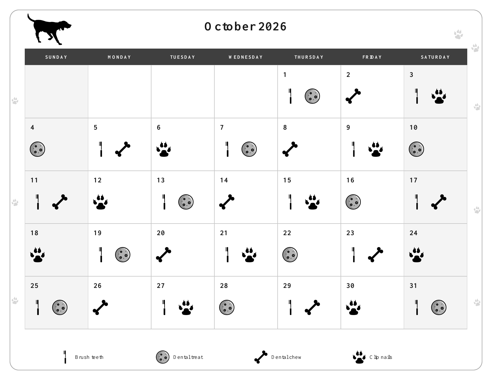

# Household Calendar Builder

A family utility for configuring recurring household tasks, choosing symbols and colors, and previewing a clean printable calendar before exporting it.

The first version is a browser-based calendar designer. Users set the month or months, define task schedules, choose SVG symbols from a searchable picker, customize the title and optional decoration, and review a live print preview. The default visual treatment stays clear and printer-friendly; color is available as an option.

## Product direction

- **Configure, preview, print.** The main experience is a set of calendar and task parameters beside a live preview of the finished page.
- **One month per page.** A single selected month produces a one-page calendar. Selecting multiple months produces one page for each month.
- **Flexible symbols and color.** A bundled symbol picker based on Font Awesome Free SVG icons helps users distinguish tasks. Users can choose colors while keeping a high-contrast print-friendly mode.
- **Household-wide.** Presets can demonstrate dog care, chores, gardening, and home maintenance, but every task name, cadence, and symbol is configurable.
- **Agent-ready later.** Once the interactive calendar builder is stable, its configuration model can support an API and an agent skill that turn natural-language requests into consistent, reviewable calendars.

## Status

The repository contains a static app shell, a versioned calendar configuration model with validation, a deterministic date engine, and a structured editor for month ranges and household task schedules. It also includes a categorized, searchable local icon picker and visual settings. The rendered calendar preview and print/PDF export are planned follow-on work.

## Run locally

The app is static HTML, CSS, and JavaScript modules; it needs no build step or server-side service. Serve the repository root with any static file server and open it in a browser:

```sh
python3 -m http.server 8000   # or: npm start
# then open http://localhost:8000/
```

Run the schema and fixture checks with Node.js 18 or later (no dependencies to install):

```sh
npm test
```

## Documentation

- [Product specification](SPEC.md)
- [Calendar configuration](docs/configuration.md)
- [Icon attribution](docs/icon-attribution.md)

## Design principles

- Make the controls obvious and keep the preview in view.
- Treat PDF and print output as the primary result.
- Use deterministic date calculations so the preview and exported pages always agree.
- Bundle icons locally and record their source and license.
- Keep configuration in the browser in the first version. No account or server is required to create a calendar.
- Preserve accessible names for task icons and keyboard support for the symbol picker and form.

## Example output

The October 2026 dog-care calendar is a finished sample: a one-page, monochrome printable with October 1 correctly placed on Thursday and tooth brushing scheduled every other day.

[Download the sample calendar PDF](examples/october-2026-dog-care-calendar-monochrome.pdf)

[](examples/october-2026-dog-care-calendar-monochrome.pdf)

## Roadmap

1. Define the calendar configuration and recurrence rules.
2. Build the date engine and parameter editor.
3. Add the symbol picker, color settings, live print preview, and PDF export.
4. Validate the dog-care example and add reusable household presets.
5. Design a stable API around the validated calendar configuration.
6. Create an agent skill that converts natural-language requests into configurations for review and consistent calendar generation.

See [SPEC.md](SPEC.md) for scope, interactions, acceptance criteria, and implementation details.
